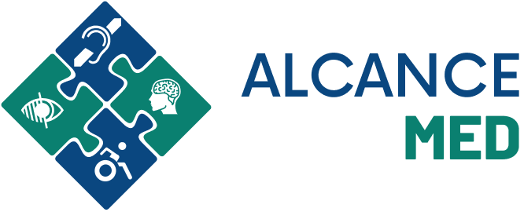
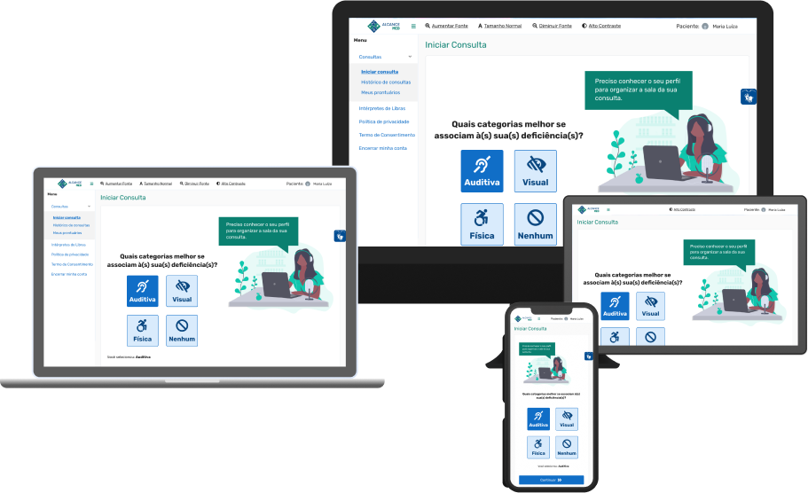

<h1 align="center">
  
</h1>

# Índice

- [Sobre](#information_source-sobre)
- [Tecnologias utilizadas](#-tecnologias-utilizadas)
- [Como baixar o projeto](#arrow_double_down-como-baixar-o-projeto)
- [Interface](#computer-interface)
- [Equipe](#-equipe)
- [Créditos](#-creditos)

## :information_source: Sobre

Este projeto foi criado durante o hackathon Mega Hack Women, por meio da Shawee em parceria com a Trybe, entre os dias 30/08/2020 e 07/09/2020.

Nossa solução é um protótipo que tem como objetivo empoderar o paciente no cuidado de sua saúde, tornando-o protagonista da sua jornada e potencializar o cuidado médico à distância, principalmente com qualidade para atender pacientes PcD auditivos, visuais e físicos. Será oferecido um sistema de curadoria para identificar os tipos de deficiência do paciente, as formas que eles se comunicam, redirecioná-los para a triagem que será útil para obter informações prévias sobre as particularidades do paciente e seus sintomas, consulta online com os elementos posicionados de forma estratégica para atender as particularidades de cada de deficiência (auditiva, visual e física).

Nosso propósito é a criação de uma plataforma para todos, ou seja, para pessoas com ou sem deficiência conseguirem navegar adequadamente do início ao fim do seu atendimento médico.

Nossa interface foi projetada utilizando as regras da WCAG, como contraste suficiente entre os itens e a total possibilidade de navegação e interação pelo teclado.

## 🚀 Tecnologias utilizadas

- HTML
- CSS
- Javascript
- Node.js
- JQuery
- Sass
- Bootstrap 4
- Git

## :arrow_double_down: Como baixar o projeto

Indicamos as seguintes formas de baixar e visualizar as páginas do projeto:

### Baixar:
1. `git clone https://github.com/NayraCruz/alcancemed.git`
1. `npm install`

### Visualizar - 1ª forma:
Comandos a inserir no terminal:
- `npm run dev`

### Visualizar - 2ª forma:
- Utilizando a extensão Live Share do VS Code:
- Acessar a url http://localhost:3000/. Se você alterou a porta durante a configuração, basta atualizar na url.

### Visualizar - 3ª forma:
- Clicando no arquivo index.html na raiz do projeto.

## :computer: Interface
Demonstração do resultado final da aplicação:

[Confira a nossa UI navegável no Figma](https://www.figma.com/proto/gj4IhUyihLbqCSf8FRN0HL/Alcance-Med-MHW?node-id=5%3A2&viewport=186%2C348%2C0.36695781350135803&scaling=min-zoom)

## Equipe

A equipe idealizadora desse projeto é formada pelas integrantes:

- [Dayanne Viana - Development](https://www.linkedin.com/in/dayanne-santos-6040011b5/)
- [Nayra Cruz - UX Design](https://www.linkedin.com/in/nayra-cruz/)
- [Vanessa Sousa - Marketing](https://www.linkedin.com/in/vanessa-sousa-9a195386)
- [Quézia Santana - Business](https://www.linkedin.com/in/queziasantana/)

## Créditos
- [AdminLTE](https://github.com/ColorlibHQ/AdminLTE)
- [Unsplash](https://unsplash.com/)
- [Pexels](https://www.pexels.com/)
- [Undraw](https://undraw.co/)

